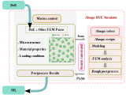

.. image:: images/logo.png
   :alt: logo
   :width: 80%
   :align: center

`Docs <https://bessagroup.github.io/rvesimulator/>`__ | `GitHub <https://github.com/bessagroup/rvesimulator.git>`__

**First publication:** July 24, 2023

Summary
-------

This repo aims to do representative volume element (RVE) simulation via `ABAQUS <https://www.3ds.com/products-services/simulia/products/abaqus/>`__.
It has two main parts:

- Part 1
    - Generate microstructure of RVE;
    - Configure material properties of RVE;
    - Configure loading conditions of RVE;
    - Encode all the information into a **Json** file as the input of ABAQUS;
    - Take the **Pickle** file generated by ABAQUS and perform further post-processing.
    
- Part 2
    - Read the Json file;
    - Run ABAQUS simulation;
    - Extract results from ABAQUS output file;
    - Encode results into a **Pickle** file.

The workflow of this repo is shown in the following figure.

Statement of need
-----------------

In order to use this repo, one needs first to know basics of ABAQUS secondary development, and basic under standing of design of experiment (DoE). 

Authorship
----------

**Authors**:
    - Jiaxiang Yi (J.Yi@tudelft.nl)

**Authors afilliation:**
    - Bessa Research Group @ Delft University of Technology

**Maintainer:**
    - Jiaxiang Yi (J.Yi@tudelft.nl)

**Maintainer afilliation:**
    - Bessa Research Group @ Delft University of Technology

Community Support
-----------------

If you find any issues, bugs or problems with this package. please contact to the maintainer.

License
-------

Copyright 2023, Jiaxiang Yi

All rights reserved.

This project is licensed under the MIT License. 
